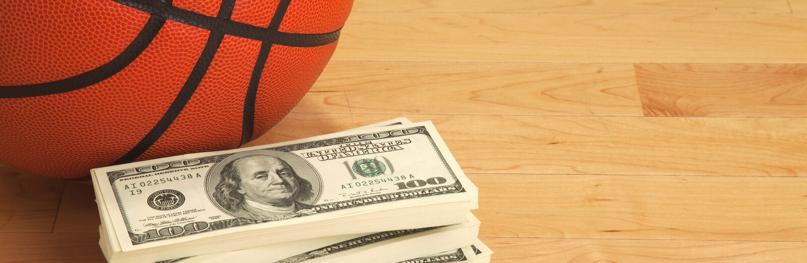
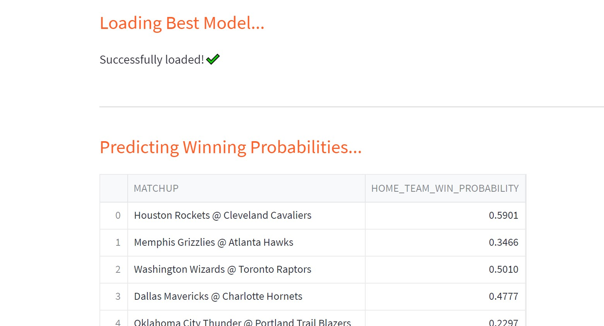

# NBA Game Predictor Project

## Problem: Increase the profitability of betting on NBA games

### Initial Step: Predict the probability that the home team will win each game

Machine learning classification models will be used to predict the probability of the winner of each game based upon historical data. This is a first step in developing a betting strategy that will increase the profitability of betting on NBA games. 

This is intended to be a learning project to demonstrate the use of machine learning to predict daily events and have a system in place to present these predictions through a website (as well as demonstrate my ability to quickly learn new tools and technologies.)

In reality, a betting strategy is a rather complex problem with many elements beyond simply picking the winner of each game. Huge amounts of manpower and money have been invested in developing such strategies, and it is not likely that a learning project will be able to compete very well with such efforts. However, it may provide an extra element of insight that could be used to improve the profitability of an existing betting strategy.

Project Repository: [https://github.com/cmunch1/nba-prediction](https://github.com/cmunch1/nba-prediction)

### Plan

Gradient boosted tree models (Xgboost and LightGBM) will be utilized to determine the probability that the home team will win each game. The model probability will be calibrated against the true probability distribution using sklearn's CalibratedClassifierCV. The probability of winning will be important in developing betting strategies because such strategies will not bet on every game, just on games with better expected values. The model will be deployed online using a [streamlit app](https://cmunch1-nba-prediction-streamlit-app-fs5l47.streamlit.app/) to predict and report winning probabilities every day. 

### Overview

 - Historical game data is retrieved from Kaggle.
 - EDA, Data Processing, and Feature Engineering are used to develop best model in either XGboost or LightGBM.
 - Data and model is added to serverless Feature Store and Model Registry
 - Model is deployed online as a Streamlit app
 - Pipelines are setup to:
   - Scrape new data from NBA website and add to Feature Store every day using Github Actions
   - Retrain model and tune hyperparameters

 Tools Used:

 - VS Code w/ Copilot - IDE
 - Pandas - data manipulation
 - XGboost - modeling
 - LightGBM - modeling
 - Scikit-learn - probability calibration
 - Optuna - hyperparameter tuning
 - Neptune.ai - experiment tracking
 - Selenium - data scraping and processing
 - ScrapingAnt - data scraping
 - BeautifulSoup - data processing of scraped data
 - Hopsworks.ai - Feature Store and Model Registry
 - Github Actions - running notebooks to scrape new data, predict winning probabilities, and retrain models
 - Streamlit - web app deployment

### Structure

Jupyter Notebooks were used for initial development and testing and are labeled 01 through 10 in the main directory. Notebooks 01 thru 06 are primarily just historical records and notes for the development process.

Key functions were moved to .py files in src directory once the functions were stable.

Notebooks 07, 09, and 10 are used in production. I chose to keep the notebooks instead of full conversion to scripts because:

 - I think they look better in terms of documentation
 - I prefer to peruse the notebook output after model testing and retraining sometimes instead of relying just on experiment tracking logs
 - I haven't yet conceptually decided on my preferred way of structuring my model testing pipelines for best reusability and maintainability (e.g. should I use custom wrapper functions to invoke experiment logging so that I can easily change providers, or should I just choose one provider and stick with their API?)

### Data

Data from the 2013 thru 2021 season has been archived on Kaggle. New data is scraped from NBA website. 

Currently available data includes:

 - games_details.csv .. (each-game player stats for everyone on the roster)
 - games.csv .......... (each-game team stats: final scores, points scored, field-goal & free-throw percentages, etc...)
 - players.csv ........ (index of players' names and teams)
 - ranking.csv ........ (incremental daily record of standings, games played, won, lost, win%, home record, road record)
 - teams.csv .......... (index of team info such as city and arena names and also head coach) 
 
 NOTES 
 - games.csv is the primary data source and will be the only data used initially
 - games_details.csv details individual player stats for each game and may be added to the model later
 - ranking.csv data is essentially cumulative averages from the beginning of the season and is not really needed as these and other rolling averages can be calculated from the games.csv data 

**New Data**

New data is scraped from [https://www.nba.com/stats/teams/boxscores](https://www.nba.com/stats/teams/boxscores)

 
**Data Leakage**

The data for each game are stats for the *completed* game. We want to predict the winner *before* the game is played, not after. The model should only use data that would be available before the game is played. Our model features will primarily be rolling stats for the previous games (e.g. average assists for previous 5 games) while excluding the current game.

I mention this because I did see several similar projects online that failed to take this into account. If the goal is simply to predict which stats are important for winning games, then the model can be trained on the entire dataset. However, if the goal is to predict the winner of a game like we are trying to do, then the model must be trained on data that would only be available before the game is played.

### Train / Test/Validation Split
  
  - Latest season is used as Test/Validation data and previous seasons are used as Train data
  
### Baseline Models
  
Simple If-Then Models

 - Home team always wins (Accuracy = 0.59, AUC = 0.50 on Train data, Accuracy = 0.49, AUC = 0.50 on Test data)
 
ML Models

 - LightGBM (Accuracy = 0.58, AUC = 0.64 on Test data)
 - XGBoost (Accuracy = 0.59, AUC = 0.61 on Test data)

### Feature Engineering

 - Covert game date to month only
 - Compile rolling means for various time periods for each team as home team and as visitor team 
 - Compile current win streak for each team as home team and as visitor team
 - Compile head-to-head matchup data for each team pair 
 - Compile rolling means for various time periods for each team regardless of home or visitor status
 - Compile current win streak for each team regardless of home or visitor status
 - Subtract the league average rolling means from each team's rolling means

### Model Training/Testing

**Models**
 - LightGBM 
 - XGBoost 

The native Python API (rather than the Scikit-learn wrapper) is used for initial testing of both models because of ease of built-in Shapley values, which are used for feature importance analysis and for adversarial validation (since Shapley values are local to each dataset, they can be used to determine if the train and test datasets have the same feature importances. If they do not, then it may indicate that the model does not generalize very well.)

The Scikit-learn wrapper is used later in production because it allows for easier probability calibration using sklearn's CalibratedClassifierCV.

**Evaluation**
 - AUC is primary metric, Accuracy is secondary metric (it is more meaningful to casual users)
 - Shapley values compared: Train set vs Test/Validation set
 - Test/Validation set is split: early half vs later half

 !
 
**Experiment Tracking**
 
Notebook 07 integrates Neptune.ai for experiment tracking and Optuna for hyperparameter tuning.

Experiment tracking logs can be viewed here: [https://app.neptune.ai/cmunch1/nba-prediction/experiments?split=tbl&dash=charts&viewId=979e20ed-e172-4c33-8aae-0b1aa1af3602](https://app.neptune.ai/cmunch1/nba-prediction/experiments?split=tbl&dash=charts&viewId=979e20ed-e172-4c33-8aae-0b1aa1af3602)

**Probability Calibration**

SKlearn's CalibratedClassifierCV is used to ensure that the model probabilities are calibrated against the true probability distribution. The Brier loss score is used to by the software to automatically select the best calibration method (sigmoid, isotonic, or none).

### Production Features Pipeline

Notebook 09 is run from a Github Actions every morning.

- It scrapes the stats from the previous day's games, updates all the rolling statistics and streaks, and adds them to the Feature Store.
- It scrapes the upcoming game matchups for the current day and adds them to the Feature Store so that the streamlit app can use these to make it's daily predictions.

A variable can be set to either use Selenium or ScrapingAnt for scraping the data. ScrapingAnt is used in production because of its built-in proxy server.

 - The Selenium notebook worked fine when ran locally, but there were issues when running the notebook in Github Actions, likely due to the ip address and anti-bot measures on the NBA website (which would require a proxy server to address)
 - ScrapingAnt is a cloud-based scraper with a Python API that handles the proxy server issues. An account is required, but the free account is sufficient for this project.

### Model Training Pipeline

Notebook 10 retrieves the most current data, executes Notebook 07 to handle hyperparameter tuning, model training, and calibration, and then adds the model to the Model Registry. The time periods used for the train set and test set can be adjusted so that the model can be tested only on the most current games.

### Streamlit App

The streamlit app is deployed at streamlit.io and can be accessed here: [https://cmunch1-nba-prediction-streamlit-app-fs5l47.streamlit.app/](https://cmunch1-nba-prediction-streamlit-app-fs5l47.streamlit.app/)

It uses the model in the Model Registry to predict the win probability of the home team for the current day's upcoming games.

### Feedback

Thanks for taking the time to read about my project. This is my primary "portfolio" project for my quest to change careers and find an entry level position in Machine Learning / Data Science. I appreciate any feedback.

Project Repository: [https://github.com/cmunch1/nba-prediction](https://github.com/cmunch1/nba-prediction)

My Linked-In profile: [https://www.linkedin.com/in/chris-munch/](https://www.linkedin.com/in/chris-munch/)

Twitter: [https://twitter.com/curiovana](https://twitter.com/curiovana)
